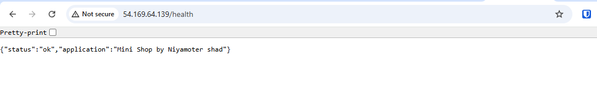
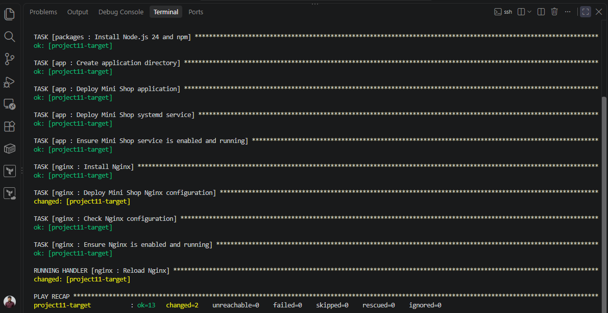
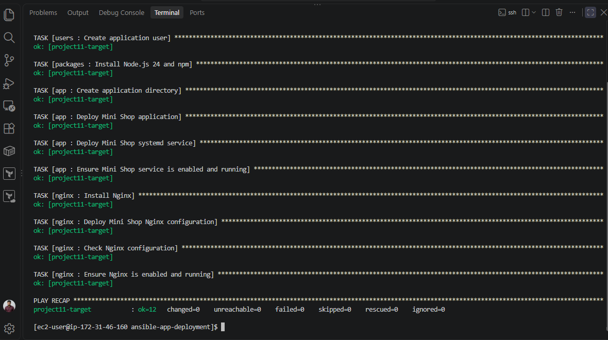

# Ansible Application Deployment

This project uses Ansible roles to deploy a Node.js Mini Shop application on an Amazon Linux 2023 server. Nginx works as a reverse proxy, and systemd manages the application service.

## Project Goal

Deploy and configure an application on a fresh target server in a repeatable way. Running the playbook again should not make unnecessary changes. When configuration changes, the relevant service handler should run.

## Architecture

- **Control node:** Runs the Ansible playbook.
- **Target node:** Runs the Node.js application and Nginx.
- Ansible connects to the target node over SSH.
- Nginx listens on port 80 and forwards requests to the Node.js application on `127.0.0.1:3000`.
- The application provides a JSON health response at `/health`.
- systemd runs the application as the `mini-shop` service.

## Project Structure

```text
ansible-app-deployment/
├── .gitignore
├── ansible.cfg
├── inventory.example
├── playbook.yml
├── group_vars/
│   └── app_servers.yml
├── roles/
│   ├── app/
│   │   ├── files/
│   │   │   └── mini-shop/
│   │   │       └── server.js
│   │   ├── handlers/
│   │   │   └── main.yml
│   │   ├── tasks/
│   │   │   └── main.yml
│   │   └── templates/
│   │       └── mini-shop.service.j2
│   ├── nginx/
│   │   ├── handlers/
│   │   │   └── main.yml
│   │   ├── tasks/
│   │   │   └── main.yml
│   │   └── templates/
│   │       └── mini-shop.conf.j2
│   ├── packages/
│   │   └── tasks/
│   │       └── main.yml
│   └── users/
│       └── tasks/
│           └── main.yml
└── docs/
    └── screenshots/
```

## Requirements

- Ansible Core 2.15 or later on the control node
- An Amazon Linux 2023 target server
- SSH access from the control node to the target on port 22
- Python 3 on the target server
- Security group rules that allow the required SSH and HTTP traffic

This project was tested with Ansible Core 2.15.3 and Amazon Linux 2023.

## Configure Inventory and SSH

Copy the example inventory:

```bash
cp inventory.example inventory.ini
vi inventory.ini
```

In `inventory.ini`:

- Set `ansible_host` to the target server address. Use its private IP when the control node is in the same VPC.
- Set `ansible_user` to the SSH username.
- Set `ansible_ssh_private_key_file` to the path of the private key on the control node.

Example:

```ini
[app_servers]
app-1 ansible_host=192.0.2.10 ansible_user=ec2-user ansible_ssh_private_key_file=/home/ec2-user/.ssh/your-key.pem
```

The IP address and key path above are examples. Replace them with values for your own environment.

Test connectivity:

```bash
ansible app_servers -m ping
```

A successful result includes `ping: pong`.

## Application Variables

The `group_vars/app_servers.yml` file contains non-sensitive application settings, such as:

- Application user and group
- Application directory
- Application port
- Shop display name

This project does not use an application password or API secret.

## Deploy

Check the playbook syntax:

```bash
ansible-playbook --syntax-check playbook.yml
```

Run the deployment:

```bash
ansible-playbook playbook.yml
```

The playbook runs the `users`, `packages`, `app`, and `nginx` roles. These roles:

- Create the application user and group
- Install Node.js and Nginx
- Deploy the application file
- Generate the systemd service and Nginx configuration from templates
- Enable and start the application and Nginx services
- Run the relevant handler when configuration changes

## Verify Deployment

Run these commands on the control node. Ansible reads the target address and SSH key from `inventory.ini`.

Check the application health endpoint directly:

```bash
ansible app_servers -m uri -a 'url=http://127.0.0.1:3000/health return_content=true status_code=200'
```

Check the health endpoint through the Nginx reverse proxy:

```bash
ansible app_servers -m uri -a 'url=http://127.0.0.1/health return_content=true status_code=200'
```

A successful response has HTTP status `200` and includes the application's JSON health response.

To test from a browser, open:

```text
http://<TARGET_PUBLIC_IP>/health
```

Replace `<TARGET_PUBLIC_IP>` with the target server's current public IP address.

## Idempotency Test

Run the playbook again after deployment:

```bash
ansible-playbook playbook.yml
```

If the configuration has not changed, the recap should show `changed=0`.

## Handler Test

Change the Nginx configuration in `roles/nginx/templates/mini-shop.conf.j2`, then run the playbook. When the template changes, the `Reload Nginx` handler should run.

This project tests the handler by adding the following response header:

```nginx
add_header X-Managed-By "Ansible Project 11" always;
```

After the configuration change, the playbook output showed the Nginx configuration task as changed and ran the `Reload Nginx` handler. The `/health` response also included the `X-Managed-By: Ansible Project 11` header.

## Sensitive Values

- The private key is stored outside the repository in the control node's `~/.ssh/` directory.
- The actual `inventory.ini` file is used as local configuration.
- `.gitignore` excludes `inventory.ini` and `*.pem`.
- `inventory.example` contains placeholder values only.
- `group_vars/app_servers.yml` contains no secrets.

## Screenshots

Deployment and test screenshots will be stored in `docs/screenshots/`.

### Public health check



### Nginx handler reload



### Idempotency test


