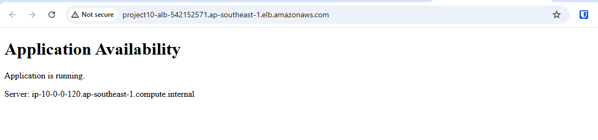
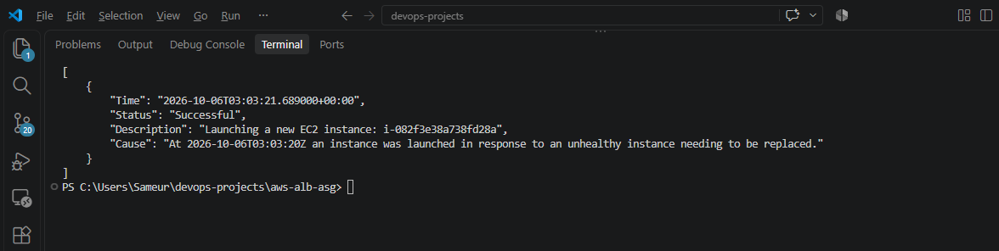
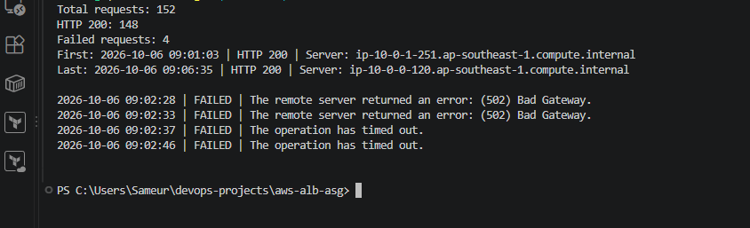
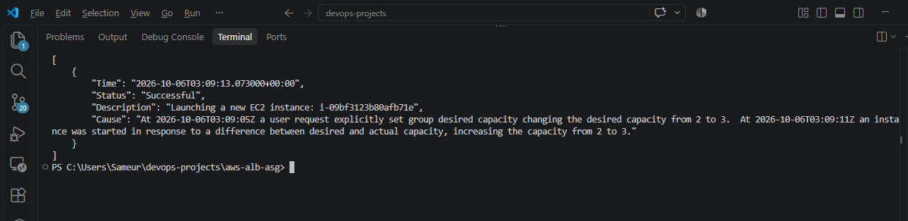
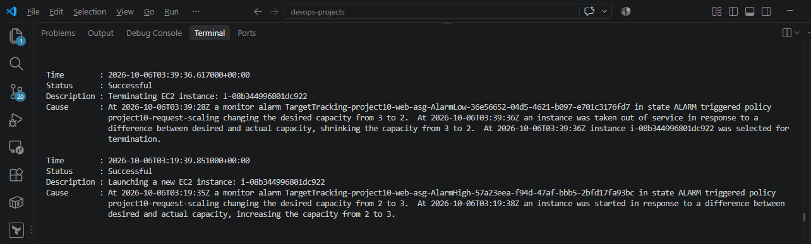

# AWS Application Availability with ALB and Auto Scaling

A Terraform lab running identical Nginx web servers across two
Availability Zones behind an Application Load Balancer.

An Auto Scaling Group replaces failed instances and adjusts capacity
using an ALB request-count target tracking policy.

## Stack

- AWS region: ap-southeast-1
- Terraform with AWS provider 6.62.0
- Amazon Linux 2023
- EC2 t3.micro
- Nginx
- Application Load Balancer
- Auto Scaling Group
- CloudWatch target tracking alarms

## Infrastructure

- One VPC and two public subnets across two Availability Zones.
- Internet-facing ALB with an HTTP listener.
- Target Group with a /health check.
- Launch Template with identical bootstrap configuration.
- ASG minimum 2, initial desired 2, maximum 3.
- Request-count target tracking policy.
- Web server HTTP access allowed only from the ALB Security Group.
- IMDSv2 required; no SSH inbound rule.

See [architecture](docs/architecture.md).

## Project Files

| File | Purpose |
|---|---|
| provider.tf | Terraform provider and region configuration |
| variables.tf | Region, AMI and instance type inputs |
| vpc.tf | VPC, subnets, Internet Gateway and routes |
| security-group.tf | ALB and web server access rules |
| user-data.sh | Nginx installation and application bootstrap |
| launch-template.tf | Common instance configuration |
| alb.tf | ALB, Target Group and listener |
| asg.tf | Capacity, placement and replacement configuration |
| scaling.tf | Request-count scaling policy |
| outputs.tf | Application URL and resource identifiers |
| .terraform.lock.hcl | Provider dependency lock |
| docs/ | Architecture, test results and evidence |

The copied key_name variable is not used by the Launch Template.

## Prerequisites

- Terraform, AWS CLI and Git installed.
- AWS CLI credentials configured for the intended account.
- Permission to create the resources in this lab.
- An available Amazon Linux 2023 x86_64 AMI in the selected region.

Verify the AWS account before deploying:

```powershell
aws sts get-caller-identity
```

Review variables.tf. The default AMI belongs to ap-southeast-1.
For another region, update the AMI and confirm the subnet AZs exist.

Save user-data.sh with LF line endings.

## Deploy

From the repository root:

```powershell
Set-Location .\aws-alb-asg

terraform init
terraform fmt
terraform validate
terraform plan -out=tfplan
terraform apply tfplan
terraform output
```

Terraform creates the ASG; the ASG creates its EC2 instances.
Wait for targets to become healthy before testing the application.

Keep the local Terraform state for later updates and cleanup.
State and saved plan files must not be committed.

## Access the Application

```powershell
$AlbUrl = terraform output -raw alb_url
Start-Process $AlbUrl

Invoke-WebRequest `
  -Uri "$AlbUrl/health" `
  -UseBasicParsing
```

The application page shows the responding server hostname.

## Verify Targets

```powershell
$TargetGroupArn = terraform output -raw target_group_arn

aws elbv2 describe-target-health `
  --region ap-southeast-1 `
  --target-group-arn $TargetGroupArn `
  --query "TargetHealthDescriptions[].{ID:Target.Id,State:TargetHealth.State}" `
  --output table `
  --no-cli-pager
```

## Verified Results

| Test | Observed result |
|---|---|
| Initial application access | 10 requests, all HTTP 200; both servers responded |
| Instance replacement | New instance created; both targets became healthy |
| Failure request monitoring | 148 HTTP 200 and 4 failures out of 152 requests |
| Manual scale-out | Desired 2 to 3; all three targets healthy |
| Manual scale-in | Desired 3 to 2; two healthy targets confirmed |
| Policy scale-out | AlarmHigh triggered desired 2 to 3; launch successful |
| Policy scale-in | AlarmLow triggered desired 3 to 2; termination successful |
| Eight-minute load test | 5176 successful requests, 0 failed |
| Web inbound rules | TCP 80 from the ALB Security Group only |

The abrupt termination test produced two HTTP 502 responses
and two timeouts. Zero downtime is not claimed.

Target health of the policy-added instance was not separately checked.
A complete AZ outage and direct-to-instance access were not tested.

See [detailed test report](docs/failure-test.md).

Evidence:

- [Failure request log](docs/failure-requests.log)
- [Policy scaling activities](docs/policy-scaling-activities.json)

## Scaling Behaviour

The demonstration target is 100 requests per target per minute.

Manual desired-capacity changes and policy-triggered scaling were
tested separately. AWS activity Cause fields identify the trigger.

Terraform ignores runtime desired_capacity changes.
The minimum and maximum sizes remain managed by Terraform.

## Cleanup

Run from the same folder using the deployment state:

```powershell
terraform plan -destroy -out=destroy-plan
terraform apply destroy-plan
```

This removes the lab resources and ASG-managed instances.
ALB, EC2, storage and public IPv4 addresses can incur charges while running.

## Project Terraform AWS Infrastructure Reference

The initial provider, variables and network code came from
[Terraform AWS Infrastructure](../terraform-aws-infrastructure/).

## Screenshots

### Application through ALB



### Instance replacement activity



### Failure test request summary



### Manual scaling activity



### Policy-triggered scale-out and scale-in


