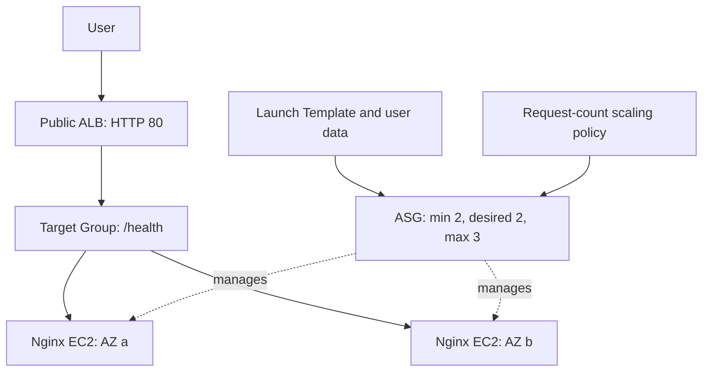

# Architecture

## Request Flow

The two EC2 nodes represent the baseline capacity.
The ASG can add a third instance in either configured Availability Zone.

## Network

Region: ap-southeast-1.

| Component | Configuration |
|---|---|
| VPC | 10.0.0.0/16 |
| Public subnet A | 10.0.0.0/24, ap-southeast-1a |
| Public subnet B | 10.0.1.0/24, ap-southeast-1b |
| Public route | 0.0.0.0/0 through the Internet Gateway |
| ALB | Internet-facing, attached to both subnets |

Both subnets use the same public route table.

Web instances receive public IP addresses for outbound package downloads.
Inbound application access is restricted by their Security Group.
This simple lab does not use private application subnets or a NAT Gateway.

## Security Groups

| Security Group | Inbound | Outbound |
|---|---|---|
| ALB | TCP 80 from 0.0.0.0/0 | All traffic |
| Web servers | TCP 80 from the ALB Security Group only | All traffic |

Web servers have no SSH inbound rule.
Launch Template metadata configuration requires IMDSv2.

## Application Bootstrap

The Launch Template uses Amazon Linux 2023 on t3.micro instances.

The user-data.sh script:

1. Installs Nginx.
2. Creates an application page showing the server hostname.
3. Creates /health with a static healthy response.
4. Starts Nginx and enables it after reboot.

All instances use the same application configuration.
The hostname identifies the responding server.

The static health endpoint checks HTTP serving.
It does not test database or other application dependencies.

## Load Balancing

- Listener: HTTP port 80.
- Target type: instance.
- Target port: 80.
- Health path: /health.
- Successful health response: HTTP 200.
- Health check interval: 15 seconds.
- Health check timeout: 5 seconds.
- Healthy and unhealthy thresholds: 2.
- Deregistration delay: 30 seconds.

Deregistration delay supports draining during target removal.
It does not guarantee that abrupt EC2 termination preserves active requests.

## Auto Scaling

- Minimum capacity: 2.
- Initial desired capacity: 2.
- Maximum capacity: 3.
- Health check type: ELB.
- Health check grace period: 180 seconds.
- Default instance warmup: 180 seconds.
- Launch Template version: the version tracked by Terraform.

The ASG spans both configured subnets and registers instances
with the ALB Target Group.

Terraform ignores subsequent desired_capacity changes so that
manual tests and automatic scaling are not reset by later applies.
Minimum and maximum capacity remain managed by Terraform.

## Scaling Policy

Target tracking uses ALBRequestCountPerTarget.

Target value: 100 requests per target per minute.
This is a demonstration threshold, not a production sizing recommendation.

CloudWatch alarms created for target tracking trigger scale-out
and scale-in within the ASG capacity limits.

## Project Origin

The provider, variables and initial VPC configuration were copied from
[Project 09](../../terraform-aws-infrastructure/).

Project 10 is independently managed in aws-alb-asg with its own
Terraform state. Project 09 code was not modified.

## Limitations

- HTTP only; HTTPS is not configured.
- Public application subnets are used for lab simplicity.
- Bootstrap depends on package-download connectivity.
- Single-instance failure was tested; an AZ outage was not tested.
- Abrupt termination produced temporary request failures.

See [test results](failure-test.md) for verified observations.