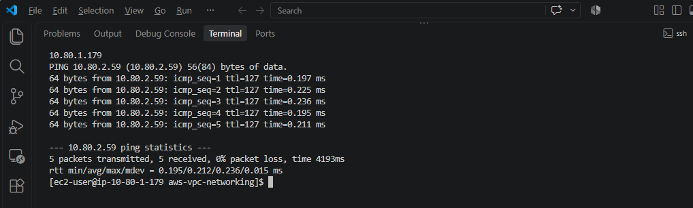
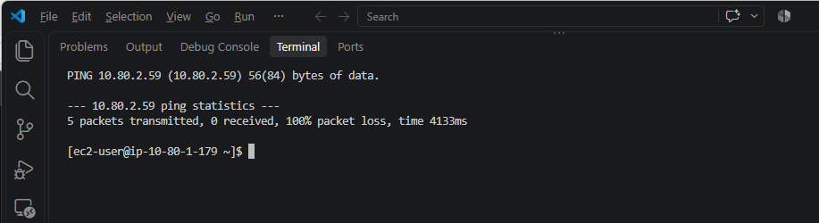
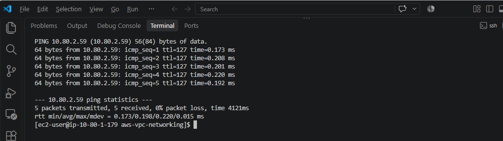
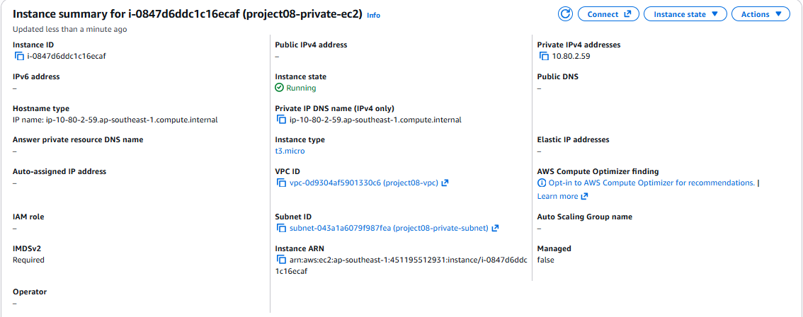
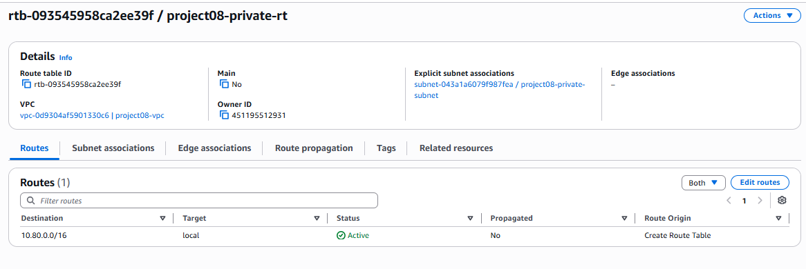

# AWS VPC Public and Private Networking

Built an AWS VPC with separate public and private subnets, explicit
route table associations, and security group rules. Verified
public-to-private connectivity through a success, failure, and recovery test.

## Environment

- Region: ap-southeast-1 (Singapore)
- OS: Amazon Linux 2023
- Instances: two t3.micro instances
- VPC: project08-vpc, 10.80.0.0/16
- Public subnet: 10.80.1.0/24
- Private subnet: 10.80.2.0/24
- No NAT Gateway or IPv6

## Architecture

The public subnet has an Internet Gateway default route.
The private subnet has only the VPC local route.

The public EC2 instance has a public IPv4 address for SSH access.
The private EC2 instance has no public IPv4 address.

Public-to-private ping uses private IP addresses through the VPC local route.

See the [architecture diagram and routing explanation](docs/architecture.md).

## Documentation

- [CIDR plan](docs/cidr-plan.md)
- [Connectivity tests and SSH troubleshooting](docs/connectivity-tests.md)
- [Network architecture](docs/architecture.md)
- [Screenshots](docs/screenshots/)

## Setup steps

1. Create project08-vpc with IPv4 CIDR 10.80.0.0/16.
2. Create public and private subnets using the CIDR plan.
3. Create project08-igw and attach it to the VPC.
4. Create project08-public-rt with the local route and
   0.0.0.0/0 pointing to the Internet Gateway.
5. Explicitly associate the public subnet with that route table.
6. Create project08-private-rt with only the local route.
7. Explicitly associate the private subnet with that route table.
8. Create project08-public-sg with SSH access from the client IPv4 /32.
9. Create project08-private-sg with ICMP IPv4 Echo Request allowed
   from project08-public-sg.
10. Launch an Amazon Linux 2023 t3.micro instance in each subnet.
    Enable public IPv4 assignment only for the public instance.
    Attach the corresponding security group to each instance.
11. SSH into the public instance and run the connectivity tests.

This lab used 165.101.132.0/24 for SSH because the shared ISP's
public address changed. A current client /32 provides narrower access.
Use your own client address when recreating the lab.

## Connectivity validation

Run from the public EC2 instance, replacing the destination if needed:

```bash
hostname -I
ping -c 5 -W 2 10.80.2.59
```

| Scenario | Result |
|---|---|
| Private SG allows ICMP from public SG | 5 replies, 0% packet loss |
| Private SG ICMP rule removed | 0 replies, 100% packet loss |
| Original ICMP rule restored | 5 replies, 0% packet loss |

The route tables remained unchanged during these tests.
The results demonstrate how the security group controls connectivity
when a valid network route exists.

## Private instance isolation

Verified in the AWS console:

- No public IPv4 or IPv6 address on the private instance.
- Private subnet explicitly associated with the private route table.
- Private route table contains only 10.80.0.0/16 -> local.
- No Internet Gateway default route or NAT Gateway.

The private instance has no direct internet access in this configuration.

## Topics practiced

- VPC and subnet CIDR planning
- Public and private subnet routing
- Internet Gateway attachment
- Explicit route table associations
- Security group references and stateful responses
- SSH troubleshooting with a changing client public IP
- Controlled connectivity failure and recovery

## Cleanup

Save evidence and push the repository before terminating the instances.

Remove only resources created for this project:

1. Terminate both EC2 instances and wait for termination to complete.
2. Check for remaining project EBS volumes and delete any no longer needed.
3. Delete the private security group before the public security group,
   because the private group references the public group.
4. Delete both project subnets.
5. Delete the two custom project route tables.
6. Detach and delete project08-igw.
7. Delete project08-vpc.

The VPC's default security group and main route table are removed
when the VPC is deleted. Keep the shared SSH key pair if other labs use it.

## Lab limitations

This project demonstrates network configuration and connectivity.
It does not provide application hosting or high availability.
The private instance has no internet egress path.

## Screenshots

### Successful connectivity



### Controlled failure



### Connectivity recovery



### Private instance details



### Private route table


