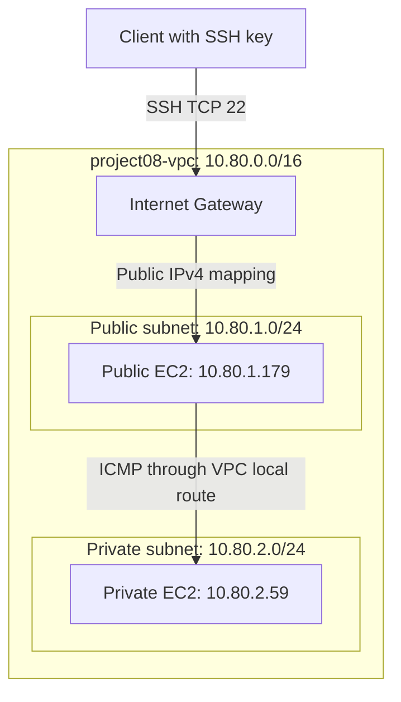

# Network Architecture

Region: ap-southeast-1 (Singapore)

## Diagram

## Route tables

Each subnet is explicitly associated with its own route table.

| Route table | Destination | Target |
|---|---|---|
| project08-public-rt | 10.80.0.0/16 | local |
| project08-public-rt | 0.0.0.0/0 | project08-igw |
| project08-private-rt | 10.80.0.0/16 | local |

The public subnet has an Internet Gateway default route.
The public instance also has an auto-assigned public IPv4 address.

The private subnet has only the VPC local route.
Its instance has no public IPv4 address.
No NAT Gateway or IPv6 was configured.

## Traffic paths

### Client to public instance

The client connects to the public instance's public IPv4 address.
The Internet Gateway maps that address to the instance's private IPv4.
The public security group allows SSH from 165.101.132.0/24.
Authentication requires the SSH private key.

### Public instance to private instance

The public instance sends ping requests to 10.80.2.59.
The destination matches the VPC local route in the public route table.
The private security group permits ICMP Echo Request from the public
security group.

This traffic stays inside the VPC and does not use the Internet Gateway.

## Security groups

| Group | Inbound rule | Source |
|---|---|---|
| project08-public-sg | SSH, TCP 22 | 165.101.132.0/24 |
| project08-private-sg | ICMP IPv4 Echo Request | project08-public-sg |

Both groups retain their default allow-all IPv4 outbound rule.
Security groups are stateful, allowing replies to permitted requests.

The SSH /24 source was used for this shared-ISP lab.
A current client /32 provides narrower access.

## Scope

This is a networking learning lab with one instance in each subnet.
It does not provide application hosting or high availability.
The private instance has no internet egress path.
