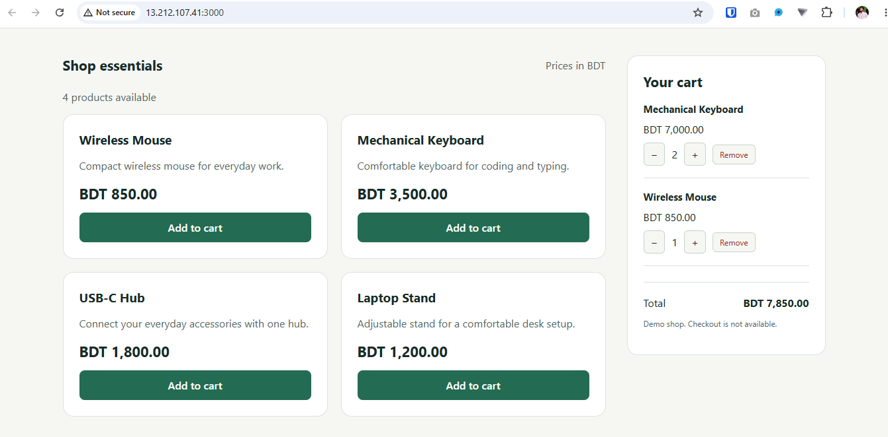
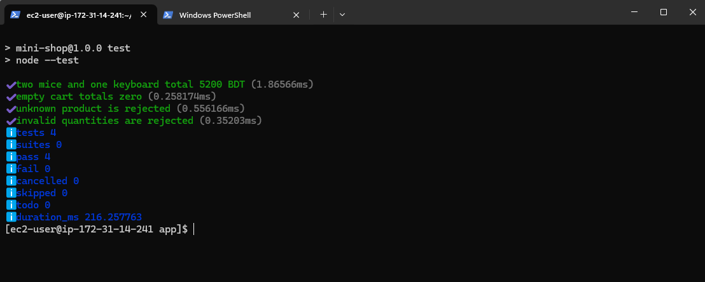
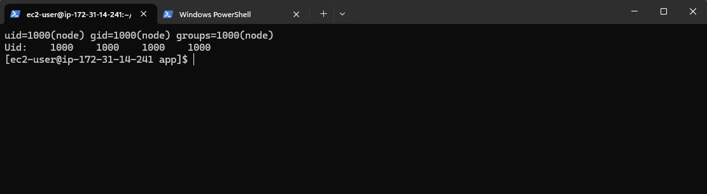
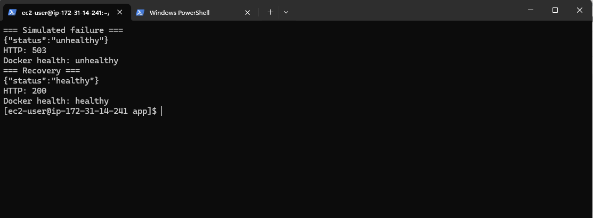
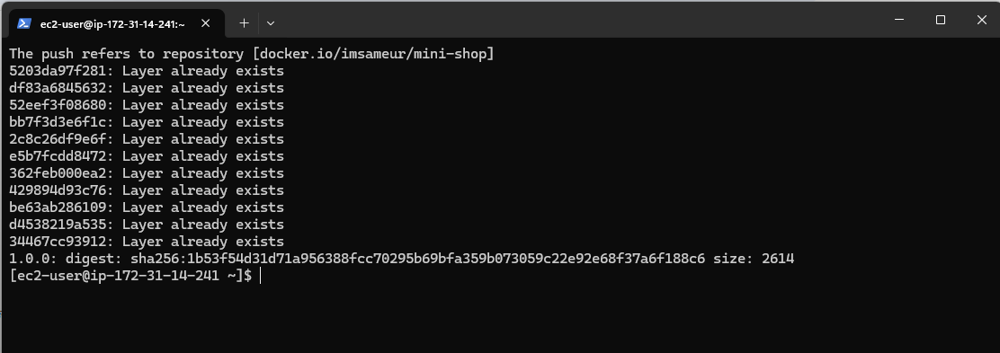
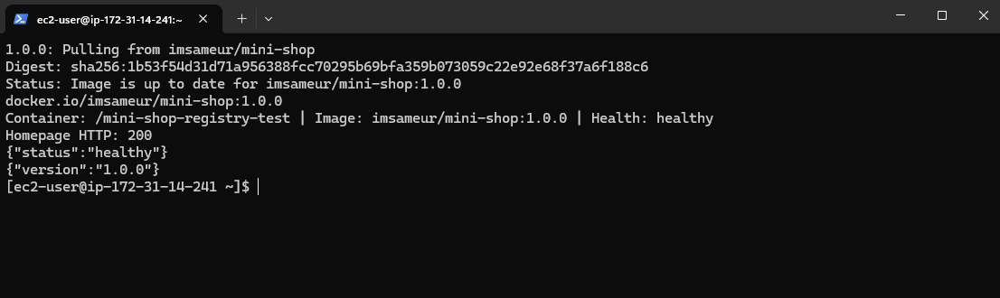

# Project 04: Dockerized Node.js Mini Shop

A demo storefront packaged as a reusable Docker image and tested on
AWS EC2 running Amazon Linux 2023.

The project demonstrates dependency installation using a lockfile,
non-root execution, environment configuration, Docker health checks,
failure simulation, and publishing a versioned image to Docker Hub.

## Application

- Four-product catalog served by an Express API.
- Browser cart with quantity controls and localStorage persistence.
- Prices calculated in integer poisha and displayed in BDT.
- Health and deployed-version endpoints.
- Demo only: no checkout, payments, authentication or database.

## Stack

Node.js 24, Express 5, HTML, CSS, JavaScript, Docker and AWS EC2.

## Run the Published Image

Requires Docker and an available host port 3000.
The published image was built and tested on Linux amd64.

```bash
sudo docker pull imsameur/mini-shop:1.0.0

sudo docker run -d \
  --name mini-shop-demo \
  -p 3000:3000 \
  -e SHOP_NAME="My Mini Shop" \
  imsameur/mini-shop:1.0.0
```

Open http://localhost:3000 on the Docker host.

For an EC2 deployment, use http://EC2_PUBLIC_IP:3000 and allow
inbound TCP port 3000 from your IP in the instance security group.
Restrict SSH access to your IP.

Docker Hub: https://hub.docker.com/r/imsameur/mini-shop

## Endpoints

| Endpoint | Purpose |
|---|---|
| / | Storefront |
| /api/products | Product catalog |
| /api/info | Configured shop name and application message |
| /health | HTTP 200 when healthy, HTTP 503 during simulated failure |
| /version | Configured application version |

SHOP_NAME is returned by /api/info.
The storefront heading currently uses the static Mini Shop branding.

## Configuration

Pass overrides using docker run -e.

| Variable | Image default | Purpose |
|---|---|---|
| PORT | 3000 | Application listening port |
| SHOP_NAME | Mini Shop | Name returned by /api/info |
| APP_VERSION | 1.0.0 | Version returned by /version |
| NODE_ENV | production | Node.js environment |
| HEALTH_FAILURE_FILE | /tmp/mini-shop-unhealthy | Marker file for failure simulation |

Changing PORT also requires updating the container side of the port mapping.
The Docker health check reads PORT automatically.

Example using a different application port:

```bash
sudo docker run -d \
  --name mini-shop-custom \
  -p 127.0.0.1:3001:4000 \
  -e PORT=4000 \
  -e SHOP_NAME="Custom Shop" \
  imsameur/mini-shop:1.0.0
```

Access this example from the host at http://localhost:3001.

## Local Development and Tests

Requires Node.js 24 and npm.
Run from the docker-nodejs-app directory:

```bash
cd app
npm ci
npm test
npm start
```

Four automated tests cover cart totals, an empty cart,
unknown products and invalid quantities.

## Build the Image

Run from the docker-nodejs-app directory:

```bash
sudo docker build \
  --build-arg APP_VERSION=1.0.0 \
  -t mini-shop:1.0.0 .
```

The Dockerfile installs runtime dependencies with npm ci --omit=dev.
Tests run separately before building; the image build does not run them.
The base tag node:24-bookworm-slim can change over time.

## Publish to Docker Hub

The following commands require push access to the imsameur namespace.
Use your own Docker Hub username when publishing your own copy.

```bash
sudo docker login --username imsameur
sudo docker tag mini-shop:1.0.0 imsameur/mini-shop:1.0.0
sudo docker push imsameur/mini-shop:1.0.0
```

## Verify Health and Non-root Execution

```bash
sudo docker logs mini-shop-demo
sudo docker inspect --format '{{.State.Health.Status}}' mini-shop-demo
sudo docker exec mini-shop-demo id
sudo docker exec mini-shop-demo sh -c 'grep "^Uid:" /proc/1/status'
curl -i http://localhost:3000/health
curl -i http://localhost:3000/version
```

The application runs as user node with UID 1000.

Health check configuration:
- Interval: 10 seconds.
- Timeout: 5 seconds.
- Start period: 10 seconds.
- Unhealthy threshold: 3 consecutive failures.

## Simulate Failure and Recovery

Create the marker file inside the container:

```bash
sudo docker exec mini-shop-demo touch /tmp/mini-shop-unhealthy
curl -i http://localhost:3000/health
```

Expect HTTP 503. After approximately 35 seconds, inspect Docker health:

```bash
sudo docker inspect --format '{{.State.Health.Status}}' mini-shop-demo
```

Remove the marker file to recover:

```bash
sudo docker exec mini-shop-demo rm /tmp/mini-shop-unhealthy
curl -i http://localhost:3000/health
```

Expect HTTP 200. After approximately 15 seconds, Docker should report healthy.

This simulates an application health failure.
It does not check real external dependencies.
Docker health status alone does not automatically restart the container.

## Repository Contents

| Path | Contents |
|---|---|
| app/src/ | Express routes and server |
| app/data/ | Product catalog |
| app/public/ | Storefront and browser cart |
| app/test/ | Automated cart tests |
| app/package-lock.json | Locked dependency versions |
| Dockerfile | Application image definition |
| .dockerignore | Files excluded from the build context |
| docs/test-results.md | Recorded verification results |
| docs/screenshots/ | Project evidence screenshots |

## Verification Evidence

See [test results](docs/test-results.md).

Verified on AWS EC2:
- Lockfile installation and four passing automated tests.
- Container endpoints and non-root application process.
- Healthy, unhealthy and recovered Docker states.
- Custom port and configuration without rebuilding.
- Docker Hub push and registry pull followed by a new container run.

The registry test reused cached layers on the same EC2 host.
It was not a clean-machine download.

## Cleanup

Remove the containers created by the README examples:

```bash
sudo docker stop mini-shop-demo mini-shop-custom
sudo docker rm mini-shop-demo mini-shop-custom
sudo docker logout
```

After the lab, stop or terminate unused EC2 resources and remove
unneeded security group rules. Preserve your work in GitHub first.

## Screenshots

### Storefront and Cart


### Automated Tests


### Non-root Execution


### Health Failure and Recovery


### Docker Hub Push


### Registry Image Verification

