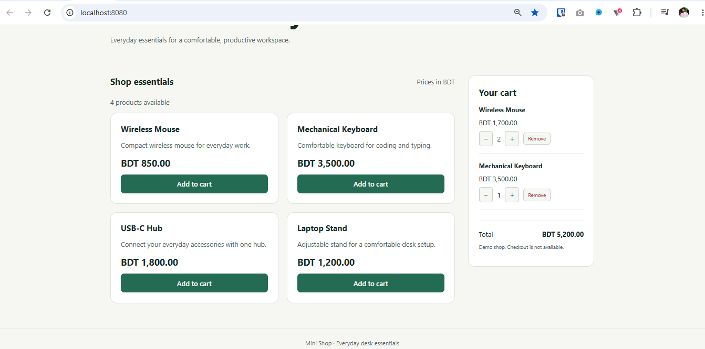
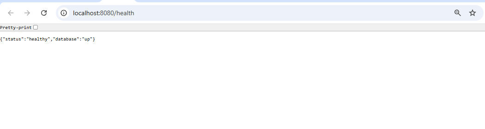

# Project 05: Node.js + MongoDB with Docker Compose

A Docker Compose deployment of Mini Shop on AWS EC2, extending
Project 04 with a MongoDB-backed notes API.

The project demonstrates database authentication, persistent storage,
health checks, startup retries and recovery from a database outage.

## Stack

- AWS EC2: Amazon Linux 2023, t3.small
- Docker Engine, Docker Compose and Buildx
- Node.js 24 and Express
- MongoDB 8.0 with the official Node.js driver

## Application scope

Mini Shop provides a product catalog and browser-side cart.
The notes API supports creating and listing notes stored in MongoDB.

Products remain in a JSON file. Cart data is not stored in MongoDB.
Checkout, user authentication, note updates and deletion are not implemented.

## Architecture

- The app and MongoDB run as separate Compose services.
- The app connects to mongo:27017 through the Compose network.
- Only the application port is published on the host.
- MongoDB stores data in the mongo_data named volume.
- The application uses a dedicated database user with readWrite access
  to the application database, rather than the MongoDB root account.
- MongoDB must pass its health check before Compose starts the app.
- The app also retries its initial database connection.
- The health endpoint checks database connectivity.

## Project files

| Path | Purpose |
| --- | --- |
| compose.yaml | Services, network configuration, volume and health checks |
| Dockerfile | Non-root Node.js application image |
| .env.example | Environment variable template without real credentials |
| mongo/init.js | Application database user, notes collection and index |
| app/src/db.js | Database connection, retries and health checks |
| app/src/app.js | HTTP routes and input validation |
| app/src/server.js | Startup and graceful shutdown |
| app/test/cart.test.js | Automated cart tests |
| docs/test-results.md | Verified test results and troubleshooting |
| docs/persistence-test.md | Persistence and outage recovery procedure |
| docs/screenshots/ | Browser verification screenshots |

## Prerequisites

Use a Linux host with Docker Engine, Docker Compose, Buildx,
Git and OpenSSL installed. Docker must be accessible to your user.

The lab was tested with approximately 2 GiB RAM and a 20 GiB root disk.
Host-level Node.js installation is not required.

```bash
docker version
docker compose version
docker buildx version
```

The Compose version used in this lab required Buildx 0.17.0 or later.

## Setup

Clone the repository if it is not already present:

```bash
git clone https://github.com/imsameur/devops-projects.git
cd devops-projects/docker-nodejs-mongodb
```

Generate a private .env file with separate random database passwords.
Run this only for an initial setup. It refuses to overwrite an existing file.

```bash
(
  set -eu
  umask 077

  if [ -e .env ]; then
    echo ".env already exists; leaving it unchanged."
    exit 1
  fi

  root_password=$(openssl rand -hex 24)
  app_password=$(openssl rand -hex 24)

  sed \
    -e "s/replace_with_root_password/$root_password/" \
    -e "s/replace_with_app_password/$app_password/" \
    .env.example > .env
)
```

Commit only .env.example. Never commit .env or private SSH keys.

The generated hexadecimal passwords are safe to use directly in the
connection URI. Custom passwords containing reserved URI characters
require appropriate percent-encoding.

Validate and start:

```bash
docker compose config --quiet
docker compose up -d --build --wait --wait-timeout 180
docker compose ps
```

Both services should become healthy.

MongoDB initialization runs only when its data directory is empty.
Changing .env later does not update users or passwords in an existing
database volume.

## Access from your computer

For this lab, allow SSH from your IP in the EC2 security group.
Browser access can use an SSH tunnel without opening port 3000 inbound.
Do not open MongoDB port 27017.

With an SSH configuration alias named project-05, run this on your
local computer and leave the terminal open:

```bash
ssh -N -L 127.0.0.1:8080:127.0.0.1:3000 project-05
```

Open http://localhost:8080 in your browser.

The Compose configuration publishes the app on host port 3000 by default.
The security group controls external access to that port.

## Endpoints

| Method | Path | Purpose |
| --- | --- | --- |
| GET | / | Mini Shop interface |
| GET | /api/info | Application information |
| GET | /api/products | Product catalog |
| GET | /version | Configured application version |
| GET | /health | Application and database health |
| POST | /api/notes | Create a note |
| GET | /api/notes | List up to 100 notes, newest first |

Run the following commands on the EC2 host:

```bash
curl -i http://localhost:3000/health

curl -i -X POST http://localhost:3000/api/notes \
  -H 'Content-Type: application/json' \
  -d '{"text":"My first persistent note"}'

curl -i http://localhost:3000/api/notes
```

Note text must be a non-empty string of at most 500 characters after
trimming. Invalid input returns HTTP 400. Database unavailability
returns HTTP 503 from health and database-dependent routes.

## Operations

```bash
# Service status
docker compose ps

# Recent application logs
docker compose logs --tail=50 app

# Recent database logs
docker compose logs --tail=50 mongo

# Follow application logs; Ctrl+C exits the log viewer
docker compose logs -f app

# Stop containers without removing them
docker compose stop

# Start existing containers
docker compose start

# Rebuild and deploy application changes
docker compose up -d --build --wait --wait-timeout 180

# Remove containers and network while preserving the named volume
docker compose down
```

The app handles SIGTERM and SIGINT to close its HTTP server and database
connection. Both services use the unless-stopped restart policy.
A failed health check alone does not automatically restart a container.

## Testing and evidence

Verified results:
- Four automated cart tests passed.
- Notes creation and reading passed.
- Invalid text and malformed JSON were rejected.
- The original note survived container removal and recreation.
- Database outage returned HTTP 503.
- Database recovery restored HTTP 200 without an app restart.
- Browser cart total was BDT 5,200 for two mice and one keyboard.

See:
- [Test results and automated test command](docs/test-results.md)
- [Persistence and recovery tests](docs/persistence-test.md)

### Mini Shop



### Health endpoint



## Limitations

This is a single-host learning deployment. The notes API has no
application-level authentication and is intended for restricted lab access.

A named volume provides persistence across container recreation,
not a backup or high availability. Disk loss or volume deletion can
remove the database. Production use would require additional controls,
including authentication, TLS, backups and monitoring.

Image tags such as mongo:8.0 and node:24-bookworm-slim are mutable;
they are not pinned to immutable image digests.

## Cleanup

To stop the lab while preserving database data:

```bash
docker compose down
```

Only when intentionally deleting all lab database data:

```bash
docker compose down --volumes
```

Before terminating EC2, push the project documentation and code to GitHub
and preserve any data you need. Then verify that unwanted EBS volumes
and allocated Elastic IPs have been removed.
