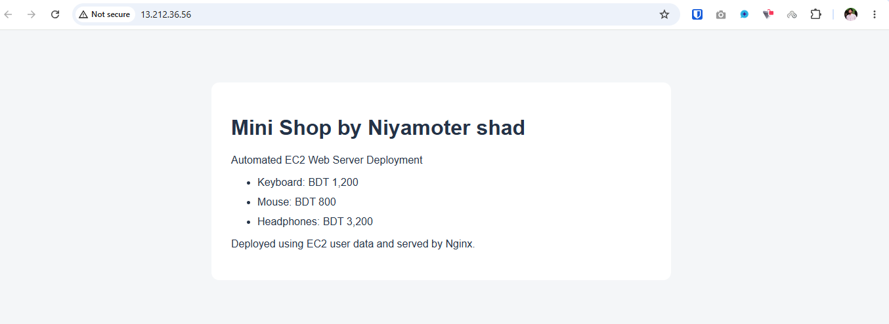
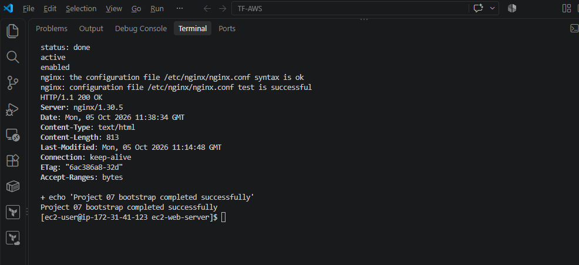
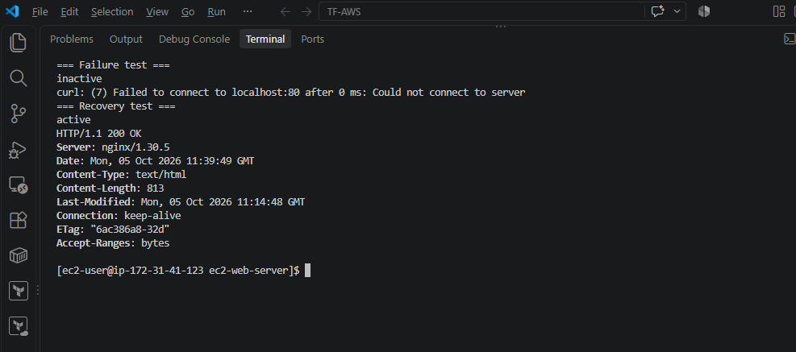
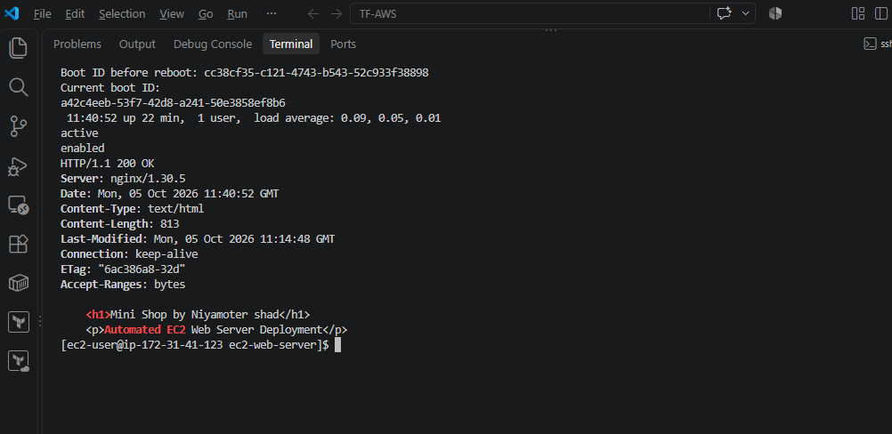

# EC2 Web Server Deployment with User Data

Deploy a static website on Amazon Linux 2023 using an EC2 user data
script. Nginx is installed and started automatically during bootstrap
and enabled to start after reboot.

Website: **Mini Shop by Niyamoter shad**

## Stack

- AWS EC2 in ap-southeast-1 (Singapore)
- Amazon Linux 2023, x86_64
- t3.micro
- 8 GiB gp3 root volume
- Nginx
- Bash and systemd
- Static HTML and CSS

## Project files

- user-data.sh: Self-contained EC2 bootstrap script
- website/index.html: Website source
- docs/architecture.md: Deployment architecture
- docs/test-results.md: Verification results
- docs/cleanup.md: AWS cleanup instructions
- docs/screenshots/: Verification screenshots

## Prerequisites

- AWS access to launch EC2 and manage Security Groups
- An SSH key pair and its private key on your computer
- A subnet with an internet gateway route
- Your current public IPv4 address for the SSH rule

## Deployment

1. Select the Singapore region.
2. Launch an Amazon Linux 2023 x86_64 instance using t3.micro.
3. Name the instance project-07-web-server.
4. Select an SSH key pair whose private key you have.
5. Enable an auto-assigned public IPv4 address.
6. Create project-07-web-sg with these inbound rules:
   - SSH, TCP 22: Your current public IPv4 address /32
   - HTTP, TCP 80: 0.0.0.0/0
7. Allow outbound access for package installation.
8. Use an 8 GiB gp3 root volume with Delete on termination enabled.
9. Paste the contents of user-data.sh into Advanced details > User data.
10. Leave the already-base64-encoded option unchecked.
11. Launch the instance and wait for status checks and bootstrap completion.
12. Open http://PUBLIC_IP in a browser.

Use the public IPv4 address of your instance in place of PUBLIC_IP.
If your public IP changes, update the SSH rule to your new IP /32.

The script embeds the HTML and does not download website files
from GitHub. Keep website/index.html and the embedded HTML in sync.

## SSH connection

Example from Windows PowerShell:

```powershell
ssh -i "C:/Users/Sameur/.ssh/devops-projects-key.pem" ec2-user@PUBLIC_IP
```

Replace the key path and PUBLIC_IP with your own values.
Do not commit private keys or AWS credentials.

## Bootstrap verification

Run on the EC2 instance:

```bash
sudo cloud-init status --long
systemctl is-active nginx
systemctl is-enabled nginx
sudo nginx -t
curl -I --max-time 5 http://localhost
sudo tail -n 30 /var/log/cloud-init-output.log
```

Expected: cloud-init done, Nginx active and enabled, valid configuration,
HTTP 200 OK, and the bootstrap success message.

## Failure and recovery test

```bash
sudo systemctl stop nginx
systemctl is-active nginx
sudo ss -ltnp 'sport = :80'
curl -I --max-time 5 http://localhost
sudo journalctl -u nginx -n 15 --no-pager
```

Expected: inactive service, no port 80 listener, and an HTTP connection
error. A browser refresh should also fail.

Recover the service:

```bash
sudo systemctl restart nginx
systemctl is-active nginx
curl -I --max-time 5 http://localhost
```

Expected: active service and HTTP 200 OK. Verify browser access again.

## Reboot test

Record the boot ID, then reboot:

```bash
cat /proc/sys/kernel/random/boot_id
sudo reboot
```

Reconnect over SSH and run:

```bash
cat /proc/sys/kernel/random/boot_id
uptime
systemctl is-active nginx
systemctl is-enabled nginx
curl -I --max-time 5 http://localhost
```

Expected: a different boot ID, active and enabled Nginx, and HTTP 200 OK.
Verify the website in the browser.

User data runs once by default. The enabled systemd service starts
Nginx after reboot.

## Script syntax check

```bash
bash -n user-data.sh
```

## Results

Initial bootstrap, browser access, failure recovery, and reboot
verification passed. The final script includes the customized website
and passed a Bash syntax check. A fresh launch with the final script
was not tested.

See [test results](docs/test-results.md) for evidence and details.

## Cleanup

Follow [cleanup instructions](docs/cleanup.md) after saving screenshots
and pushing all files to GitHub.

## Scope

This is a single-instance HTTP lab. It does not configure HTTPS,
load balancing, or high availability.

## Screenshots

### Live website



### Bootstrap verification



### Failure and recovery



### Reboot verification


