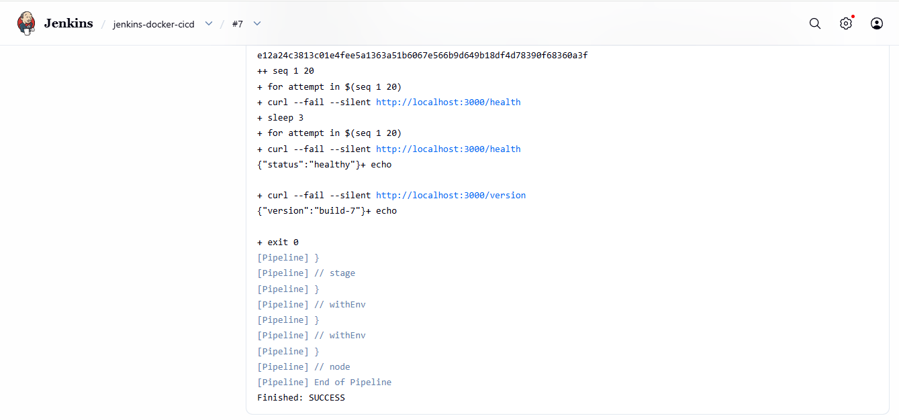
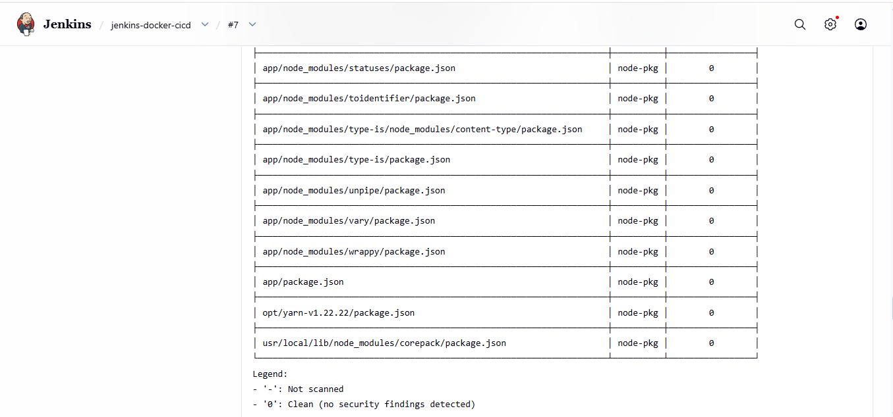
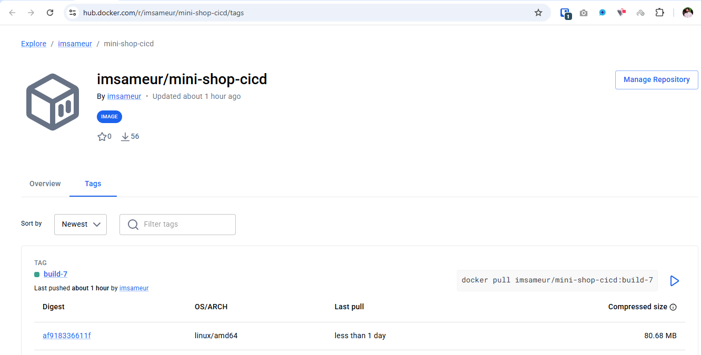
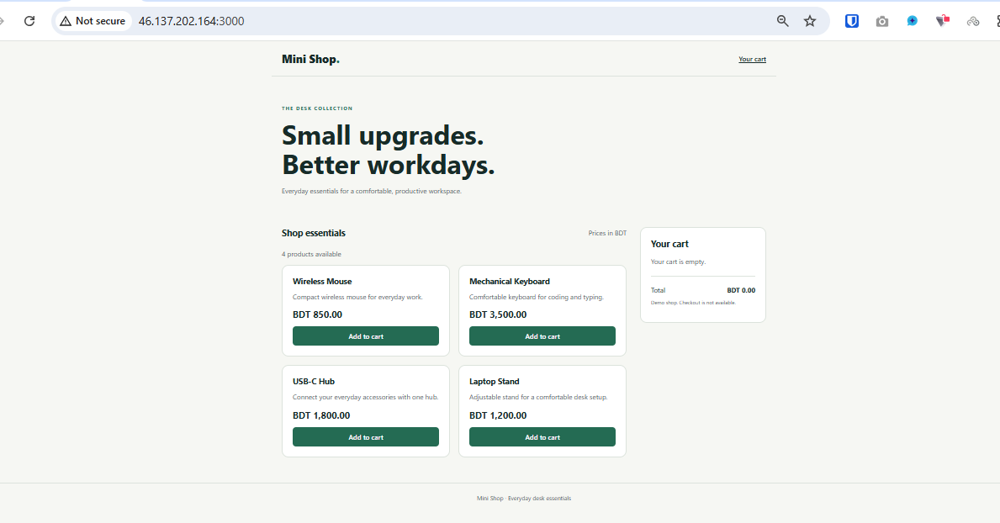
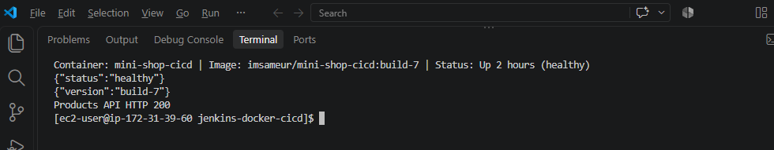
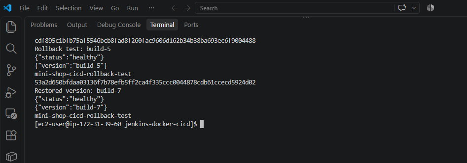

# Project 12: Jenkins Docker CI/CD

## Overview

This project builds a CI/CD pipeline for the Mini Shop Node.js application. Jenkins gets the source code from GitHub, runs tests, builds a Docker image, scans it with Trivy, pushes it to Docker Hub, and deploys it on the EC2 server.

## Pipeline flow

GitHub → Jenkins → Test → Docker build → Trivy scan → Docker Hub push → EC2 deployment

## Technologies

- Amazon Linux 2023 on AWS EC2
- Jenkins Pipeline
- Git and GitHub
- Docker
- Node.js 24 and Express
- Trivy image vulnerability scanner
- Docker Hub

## Project structure

    jenkins-docker-cicd/
    ├── app/
    │   ├── data/
    │   ├── public/
    │   ├── src/
    │   └── test/
    ├── docs/
    │   └── screenshots/
    ├── .dockerignore
    ├── .gitignore
    ├── Dockerfile
    ├── Jenkinsfile
    └── README.md

## Jenkins pipeline stages

1. **Checkout** gets the source code from the GitHub repository.
2. **Test** runs `npm ci` and the Node.js unit tests in a Node 24 container.
3. **Build Docker image** creates `imsameur/mini-shop-cicd:build-${BUILD_NUMBER}`.
4. **Security scan** runs Trivy against the image. The pipeline fails for HIGH or CRITICAL findings that have fixes available.
5. **Push image** logs in to Docker Hub using the Jenkins credential ID `dockerhub-creds`, then pushes the image.
6. **Deploy** replaces the app container on port `3000` with the newly built image and checks the health and version endpoints.

The Docker Hub token is stored in Jenkins Credentials. It is not kept in the repository.

## Application endpoints

- `/` — Mini Shop storefront
- `/health` — application health status
- `/version` — version tag of the running image
- `/api/products` — product list in JSON format

## Run tests

The Jenkins pipeline runs the tests with Docker:

    docker run --rm \
      --user "$(id -u):$(id -g)" \
      -e HOME=/tmp \
      -v "$PWD/app:/app" \
      -w /app \
      node:24-bookworm-slim \
      sh -c 'npm ci && npm test'

## Run an image manually

Replace `build-7` with the tag you want to run:

    docker pull imsameur/mini-shop-cicd:build-7
    docker run -d \
      --name mini-shop-cicd \
      -p 3000:3000 \
      imsameur/mini-shop-cicd:build-7

Check the running version and health:

    curl http://localhost:3000/health
    curl http://localhost:3000/version

## Rollback

To replace the running container with a previously published image, use its tag in the `docker run` command. Example using `build-5`:

    docker rm -f mini-shop-cicd
    docker run -d --restart unless-stopped \
      --name mini-shop-cicd \
      -p 3000:3000 \
      imsameur/mini-shop-cicd:build-5

Rollback rehearsal was performed on test port `3001`: image `build-5` returned healthy status and version `build-5`, then image `build-7` returned healthy status and version `build-7`. The deployed production container remained on `build-7` on port `3000`.

## Verification results

- Node.js unit tests: 4 passed.
- Trivy scan for pipeline build #7: no HIGH or CRITICAL findings detected.
- Docker Hub push for build #7: successful.
- Jenkins deployment for build #7: successful.
- Deployed container health: healthy on port `3000`.
- `/health`, `/version`, and `/api/products`: verified.
- Rollback rehearsal with build-5 and build-7: successful.

## Screenshots

### Jenkins pipeline success

### Clean Trivy security scan

### Docker Hub image

### Deployed Mini Shop

### Deployment endpoint checks

### Rollback rehearsal

