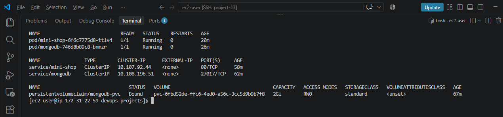
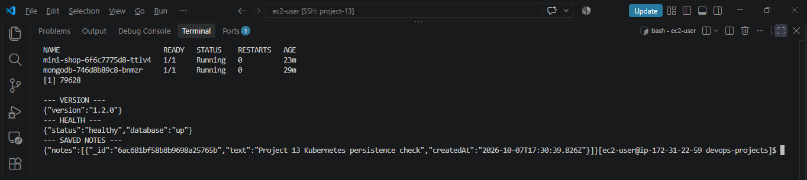
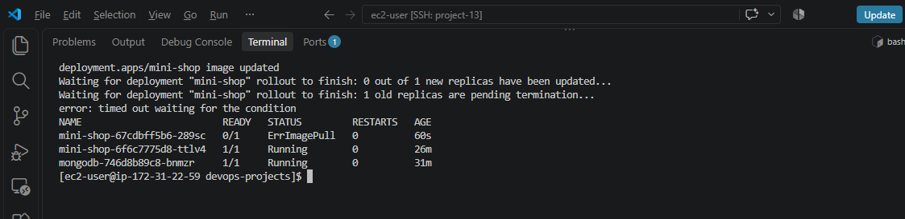
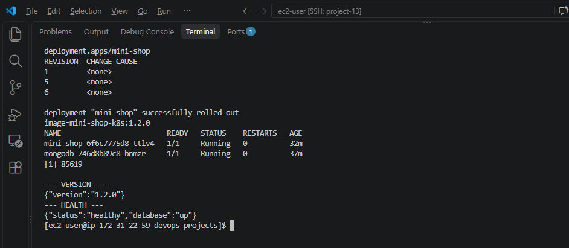

# Project 13: Kubernetes Application and Database Deployment

Deploy the Mini Shop Node.js application and MongoDB on a local Minikube
cluster. This project covers Kubernetes workloads, networking, configuration,
persistent storage, health checks, rolling updates, failure detection, and
rollback.

## Important lab limitation

MongoDB runs as a **single-instance lab database** with one replica and a
PersistentVolumeClaim. It is **not a production-grade highly available
database**. This setup is for Kubernetes learning and testing.

## Lab architecture

- The `mini-shop` Deployment runs the Node.js application on port 3000.
- The `mini-shop` ClusterIP Service exposes the app on port 80 inside the
  cluster.
- The `mongodb` Deployment runs one MongoDB pod on port 27017.
- The `mongodb` ClusterIP Service provides the app with a stable database
  endpoint.
- A 2Gi PVC mounted at `/data/db` preserves MongoDB data when its pod is
  recreated.
- A ConfigMap stores non-secret configuration. A Kubernetes Secret stores
  database passwords.

## Kubernetes topics covered

- Namespace, Deployments, and ClusterIP Services
- ConfigMaps and Secrets
- PersistentVolumeClaims and pod recreation
- Startup, readiness, and liveness probes
- CPU and memory requests and limits
- Versioned container images and rolling updates
- Failed rollout detection and rollback with `kubectl rollout undo`

## Application endpoints

| Endpoint | Purpose |
| --- | --- |
| `/health` | Reports app and database health |
| `/version` | Shows the running application version |
| `GET /api/notes` | Reads notes from MongoDB |
| `POST /api/notes` | Writes a note to MongoDB |

## Deploy the lab

Run commands from the repository root. See [docs/deployment.md](docs/deployment.md)
for the full setup, Secret creation, manifest apply order, and API test steps.

Build and load the working application image:

```bash
docker build --build-arg APP_VERSION=1.2.0 \
  -t mini-shop-k8s:1.2.0 docker-nodejs-mongodb
minikube image load mini-shop-k8s:1.2.0
```

The actual Secret values are generated on the lab host and created directly
in Kubernetes. They are not stored in Git. `manifests/secret.example.yaml`
contains placeholders only and must not be applied.

## Verification results

- Both application and MongoDB pods reached `1/1 Running`.
- `/health` returned HTTP 200 and reported the database as `up`.
- `/version` returned `1.1.0` initially and `1.2.0` after the rolling update.
- A note was written with HTTP 201 and read back with HTTP 200.
- The MongoDB pod was deleted and recreated. The previously written note
  remained available from the PVC.
- An unavailable `mini-shop-k8s:broken` image caused `ImagePullBackOff` and
  rollout timeout. The existing `1.2.0` pod remained available.
- `kubectl rollout undo` restored image `mini-shop-k8s:1.2.0`. The app health
  and saved note were verified after rollback.

The failed-image test simulates an unavailable release artifact. It tests
rollout failure detection and rollback behavior, not an application code bug.
See [docs/rollback-test.md](docs/rollback-test.md) for the test procedure.

## Resource settings

| Workload | CPU request | Memory request | CPU limit | Memory limit |
| --- | ---: | ---: | ---: | ---: |
| Mini Shop app | 100m | 128Mi | 500m | 512Mi |
| MongoDB | 250m | 512Mi | 500m | 1Gi |

## Repository structure

```text
kubernetes-nodejs/
├── manifests/
│   ├── app-deployment.yaml
│   ├── app-service.yaml
│   ├── configmap.yaml
│   ├── mongodb-deployment.yaml
│   ├── mongodb-init-configmap.yaml
│   ├── mongodb-pvc.yaml
│   ├── mongodb-service.yaml
│   ├── namespace.yaml
│   └── secret.example.yaml
├── docs/
│   ├── deployment.md
│   ├── rollback-test.md
│   └── screenshots/
└── README.md
```

## Screenshots

### Deployment and storage


### API health and persistence


### Failed rollout


### Rollback success


## Cleanup

To remove the local Minikube cluster and its lab resources:

```bash
minikube delete
```

Deleting the cluster also removes this lab's PVC and its MongoDB data.
