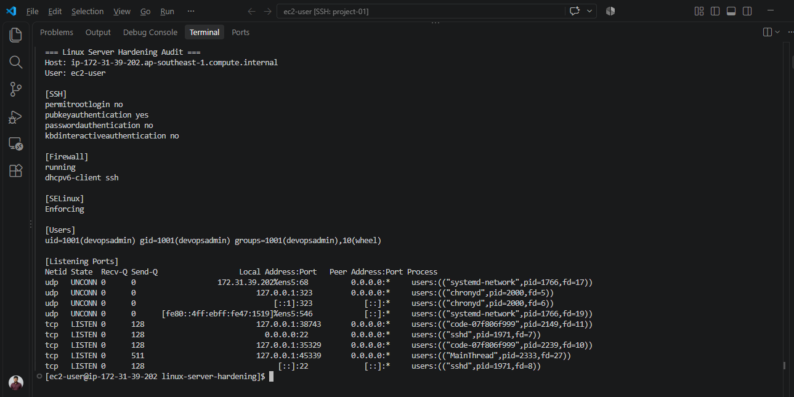
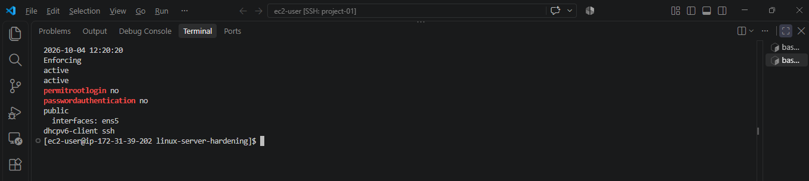
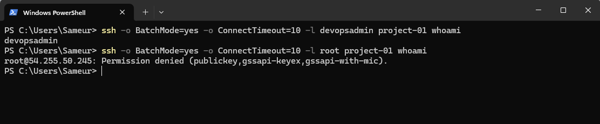
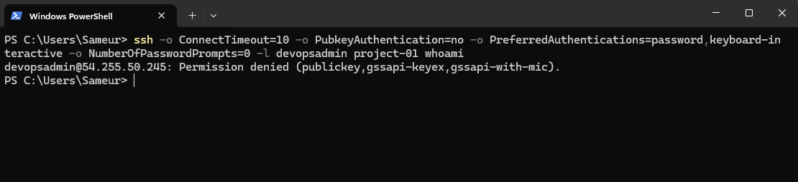

# Project 01: Linux Server Hardening & User Management

A hands-on Linux administration lab on AWS EC2 using Amazon Linux 2023.
The project covers administrator access, SSH hardening, host firewall
configuration, SELinux and verification after reboot.

## Tools

AWS EC2, Amazon Linux 2023, OpenSSH, firewalld, SELinux, Bash and Git.

## Implemented changes

- Created devopsadmin with a home directory and Bash shell.
- Added devopsadmin to wheel for password-authenticated sudo access.
- Configured SSH public-key access with correct ownership and permissions.
- Disabled direct root SSH login.
- Disabled SSH password and keyboard-interactive authentication.
- Enabled firewalld and assigned ens5 to the public zone.
- Kept ssh and dhcpv6-client as the allowed firewall services.
- Enabled SELinux enforcing mode at runtime and in persistent configuration.
- Created a read-only audit script to display the current configuration.
- Verified access restrictions and configuration persistence after reboot.

The existing ec2-user account was retained.

## Project files

| Path | Purpose |
| --- | --- |
| configs/00-project01-hardening.conf | SSH hardening settings used in the lab |
| scripts/audit-server.sh | Reports settings for manual review |
| docs/test-results.md | Recorded verification results |
| docs/recovery.md | Access troubleshooting and recovery guidance |
| docs/screenshots/ | Evidence screenshots |

## SSH configuration

The configuration file is installed on the server at:

`/etc/ssh/sshd_config.d/00-project01-hardening.conf`

```text
PermitRootLogin no
PubkeyAuthentication yes
PasswordAuthentication no
KbdInteractiveAuthentication no
```

The main sshd_config includes the drop-in directory.
Verify an administrator's key login and sudo access before applying
access restrictions. Keep the existing session open.

Validate configuration before reloading:

```bash
sudo /usr/sbin/sshd -t && sudo systemctl reload sshd
```

Then test a new SSH connection.

## Run the audit

On the configured Amazon Linux server, from this project directory:

```bash
bash scripts/audit-server.sh
```

The script requires sudo access and reports:

- Effective SSH authentication settings
- Firewall state and allowed services
- SELinux mode
- devopsadmin group membership
- Listening TCP and UDP sockets

It displays information for manual review and does not calculate
an automated PASS/FAIL result.

## Verification

Observed results include:

- devopsadmin public-key login succeeded after reboot.
- Root SSH login was rejected.
- Password and keyboard-interactive authentication were not offered.
- sshd and firewalld were active after reboot.
- ens5 remained assigned to the public firewall zone.
- SELinux remained enforcing after reboot.

See [test results](docs/test-results.md) for details and
[recovery guidance](docs/recovery.md) for troubleshooting.

## AWS network access

Security Group rules and the host firewall are separate controls.
Restrict inbound TCP port 22 to the administrator's current public IP
using /32, and verify a fresh SSH connection after changing the rule.

A dynamic client IP requires updating the Security Group.
The server-observed SSH client IP can differ from the browser's
detected public IP. The audit script does not inspect AWS rules.

## Lessons learned

- Test a new session before closing an existing administrative session.
- Configuration validation and real login tests serve different purposes.
- Runtime settings must also be made persistent and tested after reboot.
- A timeout and an authentication rejection indicate different problems.
- Loopback listeners are different from listeners on all interfaces.

## Scope

This is a learning lab, not a complete production security baseline.
A full lockout recovery drill was not performed.
Private keys, passwords and system SSH backups are not project artifacts.

## Screenshots

### Server audit


### Post-reboot verification


### Admin login and root login rejection


### Password login rejection

