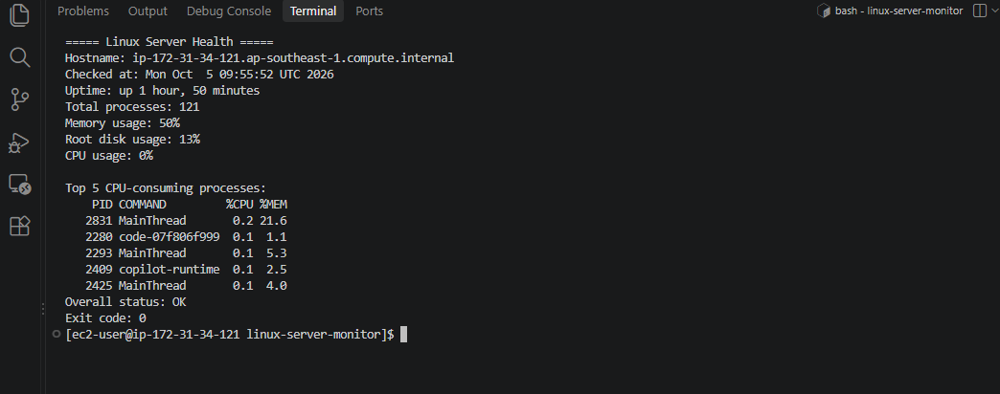
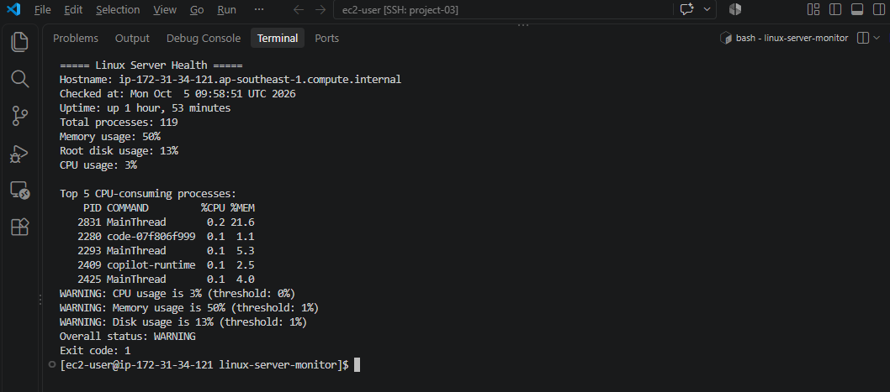

# Linux Server Monitoring Script

A simple Bash script for checking basic server health on Amazon Linux 2023.

## What it monitors

- CPU usage
- Memory usage
- Root filesystem disk usage
- Server uptime
- Total process count
- Top 5 CPU-consuming processes

## Thresholds and exit codes

CPU, memory, and disk thresholds default to `80%`.

- All metrics are below their thresholds: status `OK`, exit code `0`
- Any metric reaches or exceeds its threshold: status `WARNING`, exit code `1`

Thresholds can be changed for one run:

    CPU_THRESHOLD=70 MEMORY_THRESHOLD=75 DISK_THRESHOLD=80 ./monitor.sh

## Run

    chmod +x monitor.sh
    ./monitor.sh

## Tests

Check Bash syntax:

    bash -n monitor.sh

Run with default thresholds:

    ./monitor.sh

Test warning output and exit code:

    CPU_THRESHOLD=0 MEMORY_THRESHOLD=1 DISK_THRESHOLD=1 ./monitor.sh
    echo "Exit code: $?"

The verified results are in [test-results.md](docs/test-results.md).

## Project structure

    linux-server-monitor/
    ├── monitor.sh
    ├── README.md
    └── docs/
        ├── test-results.md
        └── screenshots/
            ├── 01-normal-run.png
            └── 02-warning-test.png

## Screenshots

Normal health check:

Threshold warning test:

