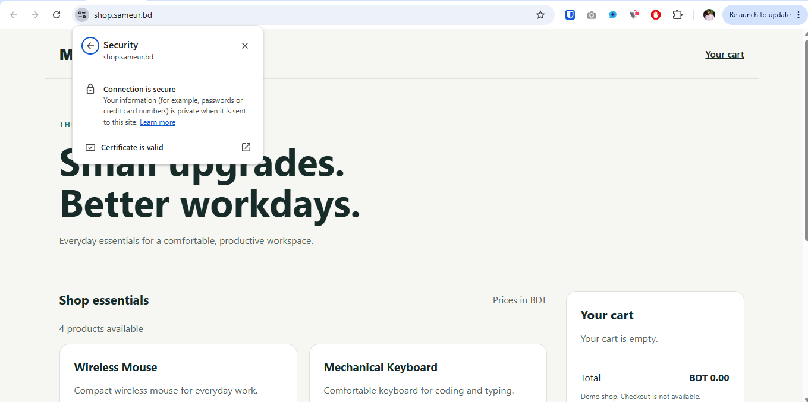
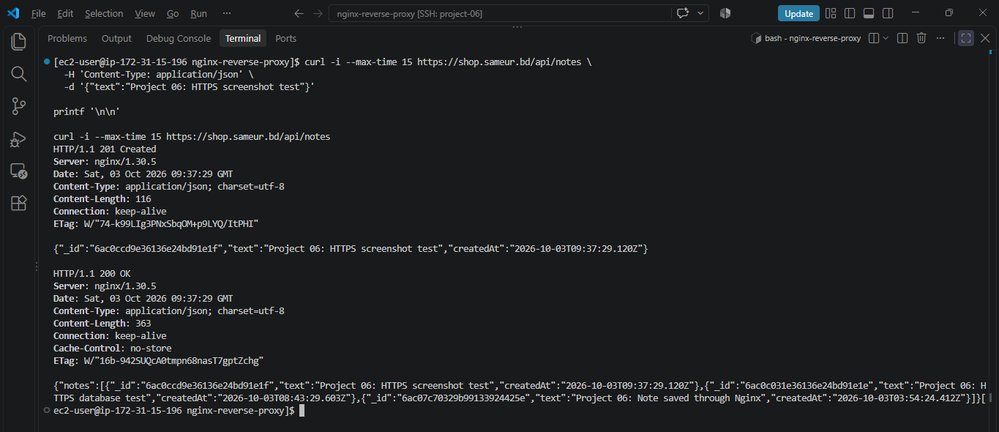
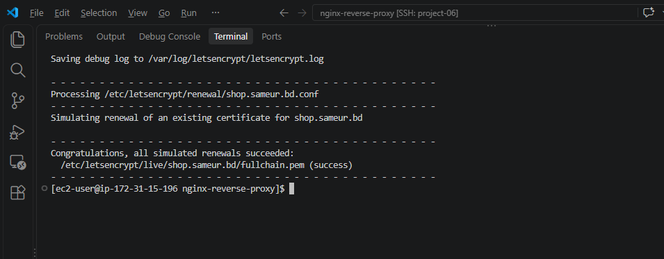
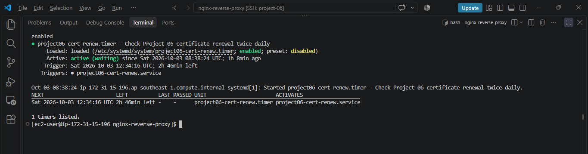

# Project 06: Nginx Reverse Proxy with HTTPS

Deploy the Mini Shop Node.js application and MongoDB on AWS EC2,
using Nginx as a reverse proxy with Let's Encrypt HTTPS.

This project extends Project 05 by adding a single public entry point,
TLS termination, HTTP-to-HTTPS redirects, and certificate renewal automation.

## Stack

- AWS EC2 with Amazon Linux 2023
- Docker and Docker Compose
- Node.js and MongoDB
- Nginx
- Let's Encrypt and Certbot
- systemd service and timer

## Architecture

Nginx receives public traffic on ports 80 and 443.
It redirects HTTP requests to HTTPS, except ACME validation requests.

Nginx terminates TLS and forwards application requests to `app:3000`
over the Compose network. The app connects to `mongo:27017`.

Neither Node.js nor MongoDB publishes a host port.
MongoDB stores data in the `mongo_data` named volume.

## Features

- Mini Shop product listing and browser cart
- MongoDB-backed notes API
- Nginx reverse proxy with forwarded request headers
- HTTPS with a publicly trusted certificate
- HTTP-to-HTTPS redirect
- Application and database health checks
- Certificate renewal checks twice daily
- Configuration and certificate files mounted read-only in Nginx
- Environment secrets and certificates excluded from Git

## Project Files

| Path | Purpose |
|---|---|
| `app/` | Application source, frontend, product data and tests |
| `mongo/init.js` | Database user initialization |
| `Dockerfile` | Application image |
| `compose.yaml` | App, MongoDB and Nginx services |
| `nginx.conf` | HTTPS reverse proxy and HTTP redirect |
| `.env.example` | Environment variable template |
| `scripts/renew-cert.sh` | Certificate renewal check and Nginx reload |
| `systemd/` | Renewal service and timer |
| `docs/tls-setup.md` | First deployment and certificate setup |
| `docs/test-results.md` | Verified test results |
| `docs/screenshots/` | Deployment evidence |

## Prerequisites

- An AWS EC2 instance running Amazon Linux 2023
- Docker running and accessible to the deployment user
- Docker Compose v2, Git and OpenSSL
- A domain or subdomain pointing to the EC2 public IPv4
- Inbound TCP 80 and 443 allowed in the EC2 security group
- SSH restricted to an approved administrator IP or range

The lab used `shop.sameur.bd` with Cloudflare DNS-only mode.
Replace this domain in the configuration and setup commands
when deploying your own instance.

## Setup

### 1. Get the project

```bash
git clone https://github.com/imsameur/devops-projects.git
cd devops-projects/nginx-reverse-proxy
```

If the repository is already cloned, use its existing project directory.

### 2. Configure environment variables

```bash
cp -n .env.example .env
chmod 600 .env
```

Generate two separate passwords:

```bash
openssl rand -hex 24
openssl rand -hex 24
```

Edit `.env` and use one value for `MONGO_INITDB_ROOT_PASSWORD`
and the other for `MONGO_APP_PASSWORD`.

Set the database name and usernames using `.env.example` as a reference.
Keep real credentials only in `.env`.

MongoDB initialization runs when its data directory is first created.
Changing passwords in `.env` does not update users in an existing database.

### 3. Set up TLS and start the stack

Follow [TLS Setup](docs/tls-setup.md).

On a fresh server, obtain the certificate using the temporary HTTP
configuration before enabling the final HTTPS configuration.
The final `nginx.conf` requires certificate files to exist.

### 4. Verify

```bash
docker compose ps
docker compose exec nginx nginx -t

curl -I http://shop.sameur.bd/health
curl -i https://shop.sameur.bd/health
```

Expected results:

- App and MongoDB are healthy; Nginx is running.
- Nginx configuration validation succeeds.
- HTTP returns 301 with the matching HTTPS URL.
- HTTPS returns 200 with `{"status":"healthy","database":"up"}`.

Open `https://shop.sameur.bd` in a browser to view Mini Shop.

## API Test

Create a note:

```bash
curl -i https://shop.sameur.bd/api/notes \
  -H 'Content-Type: application/json' \
  -d '{"text":"Project 06: HTTPS database test"}'
```

Read notes:

```bash
curl -i https://shop.sameur.bd/api/notes
```

Expected responses: POST returns 201; GET returns 200 with the saved note.

## Operations

Run these commands from the project directory.

View service status and logs:

```bash
docker compose ps
docker compose logs --tail=50 nginx
docker compose logs --tail=50 app
```

Validate and reload Nginx:

```bash
docker compose exec -T nginx nginx -t &&
docker compose exec -T nginx nginx -s reload
```

After changing Nginx port mappings or mounts:

```bash
docker compose up -d --no-deps nginx
```

Check certificate renewal scheduling and logs:

```bash
sudo systemctl list-timers --all project06-cert-renew.timer
sudo journalctl -u project06-cert-renew.service -n 30 --no-pager
```

The renewal script reloads Nginx after each successful Certbot check,
including when no certificate is due for renewal.

## Screenshots

### HTTPS Browser Access

Mini Shop served over HTTPS with a trusted certificate.



### HTTPS Database API

Creating a note returns 201; reading saved notes returns 200.



### Certificate Renewal Simulation

Certbot successfully simulated certificate renewal.



### Automatic Renewal Timer

The systemd timer is enabled and waiting for its next scheduled run.



## Testing

See [Test Results](docs/test-results.md) for the completed checks.

Testing covered reverse proxy access, database writes and reads,
app outage and recovery, HTTPS, redirects, certificate renewal
simulation, and systemd renewal service execution.

## Troubleshooting

- **502 Bad Gateway:** Check app health and Nginx/app logs.
- **502 after app recreation:** The app IP may have changed.
  Validate and reload Nginx to resolve the upstream again.
- **Certificate file missing:** Complete the initial HTTP certificate
  setup before using the final HTTPS configuration.
- **HTTPS timeout:** Check DNS, EC2 security group TCP 443,
  and the Nginx Compose port mapping.
- **Renewal failure:** Check DNS, inbound TCP 80, the ACME challenge
  route, and renewal service logs.
- **Nginx read-only entrypoint message:** The default configuration is
  intentionally mounted read-only. Use `nginx -t` and startup logs
  to identify actual configuration errors.

## Scope and Limitations

- This is a learning deployment on one EC2 instance.
- It does not provide high availability or load balancing.
- HTTPS protects traffic between the browser and Nginx.
  Internal proxy traffic uses HTTP on the Compose network.
- The demo notes API has no user authentication.
  Do not store sensitive or real customer data.
- Container image tags are not pinned to immutable digests.
- The domain may be unavailable after the lab infrastructure is removed.

## Shutdown and Cleanup

Disable the renewal timer before stopping the lab:

```bash
sudo systemctl disable --now project06-cert-renew.timer
docker compose down
```

`docker compose down` preserves the MongoDB named volume.
Adding `-v` deletes the volume and its database data.

After saving all code, documentation and screenshots to GitHub:

- Terminate the lab EC2 instance when no longer needed.
- Check for remaining EBS volumes and Elastic IPs.
- Remove the lab DNS record if the server is removed.