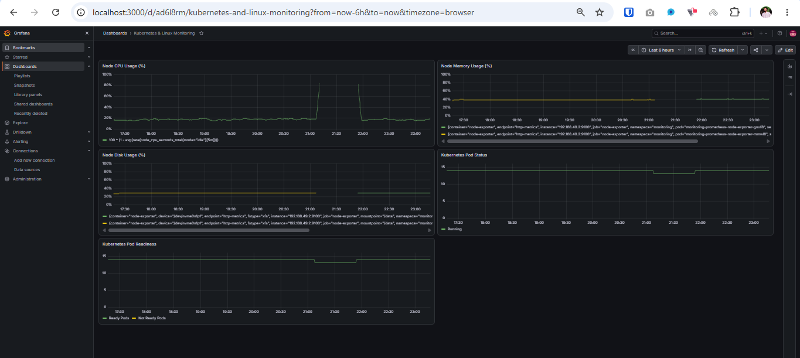
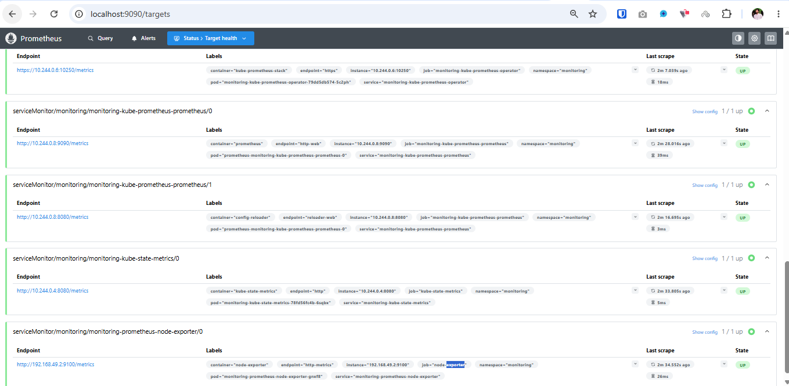
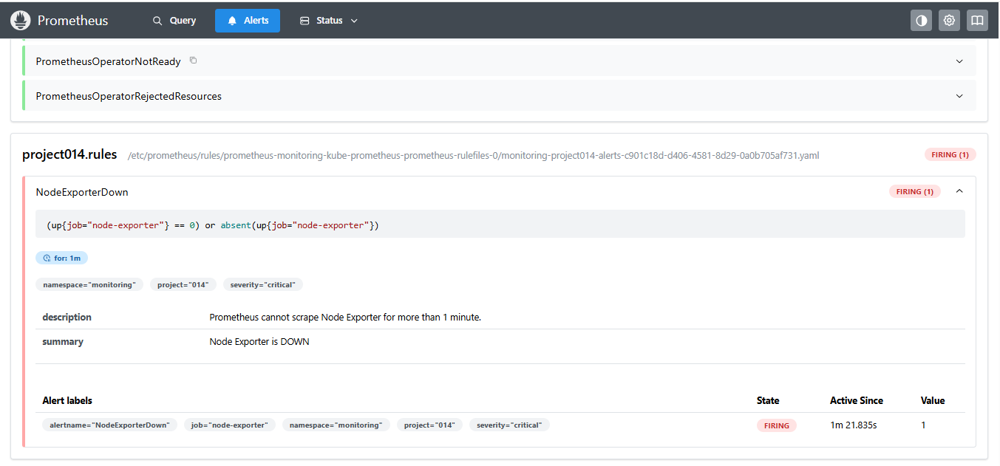
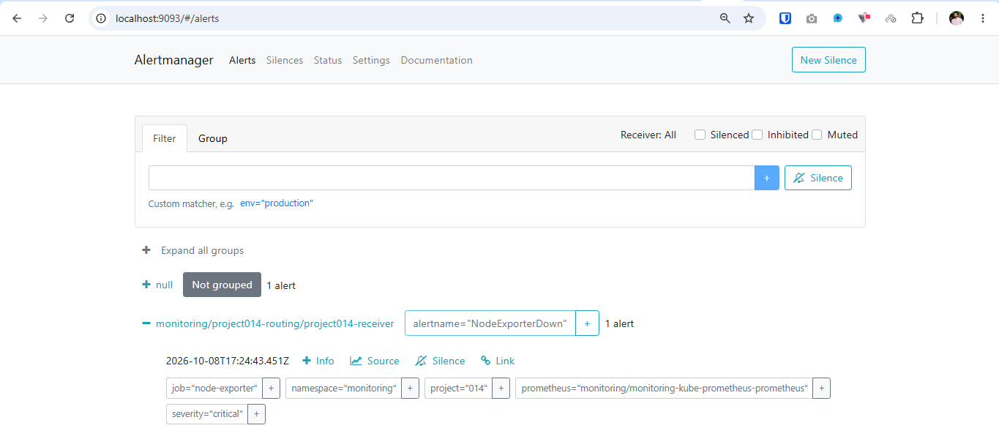
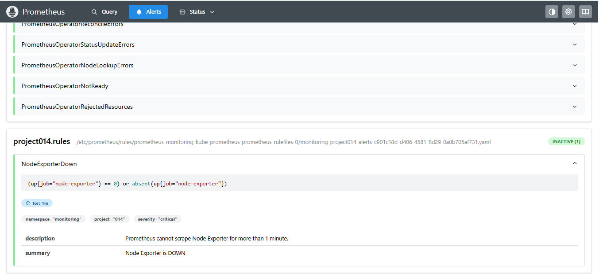
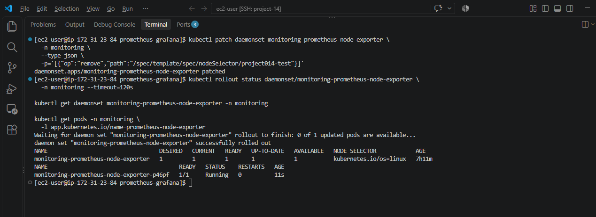

# Project - Prometheus & Grafana Monitoring

## Overview

A Kubernetes monitoring project deployed on AWS EC2 using Minikube.

This project uses Prometheus, Grafana, Node Exporter, kube-state-metrics, and Alertmanager to monitor infrastructure health and detect failures.

The complete failure detection and recovery workflow was tested successfully.

## Architecture

```text
AWS EC2 (Amazon Linux 2023)
|
+-- Docker
    |
    +-- Minikube (Kubernetes)
        |
        +-- monitoring namespace
            |
            +-- Prometheus
            |   +-- Node Exporter metrics
            |   +-- Kubernetes metrics
            |   +-- Alert rules
            |
            +-- Grafana
            |   +-- CPU Dashboard
            |   +-- Memory Dashboard
            |   +-- Disk Dashboard
            |   +-- Pod Status Dashboard
            |   +-- Pod Readiness Dashboard
            |
            +-- Alertmanager
                +-- Alert routing
```

## Technologies

- AWS EC2
- Amazon Linux 2023
- Docker
- Kubernetes (Minikube)
- Helm
- Prometheus
- Grafana
- Node Exporter
- kube-state-metrics
- Alertmanager

## Repository Structure

```text
prometheus-grafana/
├── prometheus/
│   ├── values.yaml
│   └── alert-rules.yml
├── alertmanager/
│   └── alertmanager.yml
├── dashboards/
│   └── kubernetes-overview.json
├── docs/
│   ├── incident-runbook.md
│   └── test-results.md
├── screenshots/
│   ├── 01-grafana-dashboard.png
│   ├── 02-prometheus-targets.png
│   ├── 03-alert-firing.png
│   ├── 04-alertmanager-routing.png
│   ├── 05-alert-resolved.png
│   └── 06-exporter-recovery.png
└── README.md
```

## Prerequisites

- AWS EC2 instance with sufficient CPU and memory
- Docker installed
- Minikube installed
- kubectl installed
- Helm installed

Tested environment:

- Minikube: v1.39.0
- Kubernetes: v1.37.0
- Helm chart: kube-prometheus-stack 92.1.1
- Namespace: monitoring

## Deployment

Start Minikube:

```bash
minikube start --driver=docker --cpus=2 --memory=6144
```

Add the Helm repository:

```bash
helm repo add prometheus-community https://prometheus-community.github.io/helm-charts
helm repo update
```

Create the monitoring namespace:

```bash
kubectl create namespace monitoring
```

Install the monitoring stack from the repository root:

```bash
helm install monitoring prometheus-community/kube-prometheus-stack \
  --version 92.1.1 \
  --namespace monitoring \
  -f prometheus/values.yaml \
  --wait --timeout 10m
```

Apply custom Prometheus alert rules:

```bash
kubectl apply -f prometheus/alert-rules.yml
```

Apply Alertmanager routing:

```bash
kubectl apply -f alertmanager/alertmanager.yml
```

Verify monitoring pods:

```bash
kubectl get pods -n monitoring
```

## Access Monitoring Tools

Use separate terminals for each port-forward command.

Prometheus:

```bash
kubectl port-forward -n monitoring \
  svc/monitoring-kube-prometheus-prometheus 9090:9090
```

URL: http://localhost:9090

Grafana:

```bash
kubectl port-forward -n monitoring \
  svc/monitoring-grafana 3000:80
```

URL: http://localhost:3000

Alertmanager:

```bash
kubectl port-forward -n monitoring \
  svc/monitoring-kube-prometheus-alertmanager 9093:9093
```

URL: http://localhost:9093

When accessing EC2 remotely, use SSH port forwarding.
Do not expose monitoring ports publicly.

Grafana username: `admin`

Retrieve the Grafana password from the Kubernetes Secret:

```bash
kubectl get secret monitoring-grafana -n monitoring \
  -o jsonpath="{.data.admin-password}" | base64 --decode
```

Do not commit credentials to Git.

## Grafana Dashboard

Dashboard: Kubernetes & Linux Monitoring

Five panels were created:

1. Node CPU Usage (%)
2. Node Memory Usage (%)
3. Node Disk Usage (%)
4. Kubernetes Pod Status
5. Kubernetes Pod Readiness

Example CPU PromQL:

```promql
100 * (1 - avg(rate(node_cpu_seconds_total{mode="idle"}[5m])))
```

Example Memory PromQL:

```promql
100 * (1 - node_memory_MemAvailable_bytes / node_memory_MemTotal_bytes)
```

Example Disk PromQL:

```promql
100 * (1 - node_filesystem_avail_bytes{mountpoint="/data",fstype="xfs"} / node_filesystem_size_bytes{mountpoint="/data",fstype="xfs"})
```

Disk metrics use the `/data` mount inside the Minikube node.

Example Pod Status PromQL:

```promql
sum by (phase) (kube_pod_status_phase == 1)
```

Example Pod Readiness PromQL:

```promql
sum(kube_pod_status_ready{condition="true"} == 1) or vector(0)
```

```promql
sum(kube_pod_status_ready{condition="false"} == 1) or vector(0)
```

The second readiness query counts explicitly false readiness conditions.

Importable dashboard JSON:

`dashboards/kubernetes-overview.json`

## Prometheus Alert Rule

Custom alert: `NodeExporterDown`

```promql
(up{job="node-exporter"} == 0) or absent(up{job="node-exporter"})
```

Alert configuration:

- Severity: critical
- Duration: 1 minute
- Namespace: monitoring

The `absent()` expression detects when the exporter target disappears completely.

## Alertmanager Routing

Custom receiver:

`monitoring/project014-routing/project014-receiver`

Critical NodeExporterDown alerts were successfully routed to this receiver.

External email, Slack, and webhook notifications were not configured or tested.

## Failure Simulation

Temporarily prevent the Node Exporter DaemonSet from scheduling:

```bash
kubectl patch daemonset monitoring-prometheus-node-exporter \
  -n monitoring --type merge \
  -p '{"spec":{"template":{"spec":{"nodeSelector":{"project014-test":"disabled"}}}}}'
```

Verify the exporter is unavailable:

```bash
kubectl get daemonset monitoring-prometheus-node-exporter -n monitoring
```

Expected during failure: READY 0

Wait for the NodeExporterDown alert to enter FIRING state in Prometheus.

Check Alertmanager for the routed alert.

## Recovery

Remove the temporary test nodeSelector:

```bash
kubectl patch daemonset monitoring-prometheus-node-exporter \
  -n monitoring --type json \
  -p='[{"op":"remove","path":"/spec/template/spec/nodeSelector/project014-test"}]'
```

Verify recovery:

```bash
kubectl rollout status daemonset/monitoring-prometheus-node-exporter \
  -n monitoring --timeout=120s

kubectl get daemonset monitoring-prometheus-node-exporter -n monitoring
```

Expected: READY 1

Prometheus query:

```promql
up{job="node-exporter"}
```

Expected result: `1`

The NodeExporterDown alert should become INACTIVE and disappear from Alertmanager active alerts.

## Test Results

Successfully verified:

- Prometheus metrics collection
- Grafana dashboard visualization
- Node Exporter failure detection
- Prometheus alert FIRING
- Alertmanager internal routing
- Node Exporter recovery
- Prometheus alert resolution

Verified workflow:

**Failure -> Alert FIRING -> Routing -> Recovery -> Resolved**

External notification delivery was not tested.

Detailed results: [Test Results](docs/test-results.md)

Incident response guide: [Incident Runbook](docs/incident-runbook.md)

## Screenshots

### Grafana Dashboard



### Prometheus Targets



### Alert FIRING



### Alertmanager Routing



### Alert Resolved



### Node Exporter Recovery



## Conclusion

Project 014 demonstrates Kubernetes infrastructure monitoring,
failure detection, alert routing, recovery, and alert resolution
using Prometheus, Grafana, and Alertmanager.
